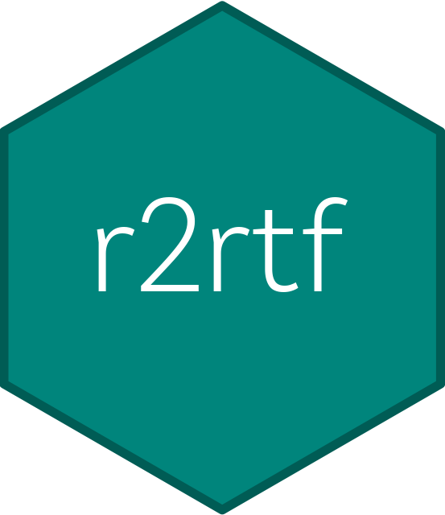

# r2rtf 

<!-- badges: start -->

<!-- badges: end -->

## Overview

`r2rtf` is an R package to create production-ready tables and figures in
RTF format. The R package is designed to

-   provide simple “verb” functions that correspond to each component of
    a table, to help you translate data frame(s) to a table in RTF file.
-   enables pipes (`%>%`).
-   only focus on **table format**.
    -   Data manipulation and analysis shall be handled by other R
        packages. (e.g., `tidyverse`)
-   minimizes package dependency

## Installation

You can install the package via CRAN:

    install.packages("r2rtf")

Or, install from GitHub:

    remotes::install_github("Merck/r2rtf")

## Highlighted Features

The R package`r2rtf` provided flexibility to enable features below:

-   Necessary options to create highly customized RTF table and figure.
-   Simple to use parameters and data structure.
    -   Customized column header: split by `"|"`.
    -   Three required parameters for the output tables (data, filename,
        column relative width).
    -   Flexible and detail control of table structure.
-   Format control in cell, row, column and table level for:
    -   Border Type: single, double, dash, dot, etc.
    -   Alignment: left, right, center, decimal.
    -   Column width.
    -   Text appearance: **bold**, *italics*, <s>strikethrough</s>,
        underline and any combinations.
    -   Font size.
    -   Text and border color (657 different colors named in `color()`
        function).
    -   Special characters: any character in UTF-8 encoding (e.g.,
        Greek, Symbol, Chinese, Japanese, Korean).
-   Append several tables into one file.
-   Pagination.
-   Built-in raw data for validation.

## Simple Example

    library(dplyr)
    library(r2rtf)

    head(iris) %>%
      rtf_body() %>%                 # Step 1 Add attributes
      rtf_encode() %>%               # Step 2 Convert attributes to RTF encode
      write_rtf(file = "ex-tbl.rtf") # Step 3 Write to a .rtf file

Click here to see the output

-   [More Examples](https://merck.github.io/r2rtf/articles/index.html)

## Example Efficacy Table

-   [Source
    code](https://merck.github.io/r2rtf/articles/example-efficacy.html)

Click here to see the output

## Example Safety Table

-   [Source
    code](https://merck.github.io/r2rtf/articles/example-ae-summary.html)

Click here to see the output

